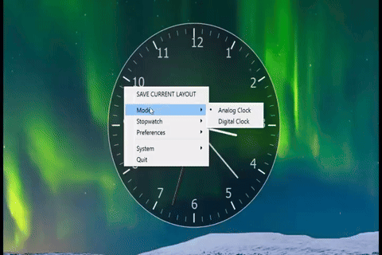

# DT Clock 🕰️

**Your desktop deserves a better clock.**

[](https://ko-fi.com/pyrategfxproductions)

<p align="center">
  <a href="https://www.python.org"></a>
  <a href="https://doc.qt.io/qt-6/pyqt5-index.html"></a>
  <a href="https://microsoft.com/windows"></a>
  <a href="https://archlinux.org"></a>
</p>

**A sleek, customizable, and minimalist floating analog clock for your desktop.**

DT Clock is a highly versatile desktop widget designed for both **Linux (CachyOS/Arch/KDE)** and **Windows**. It combines a classic analog aesthetic with modern features like transparency, window layering, a built-in precision stopwatch, and **13 designer watch themes** — so your clock matches your setup, not the other way around.



---

## ✨ Key Features

- **🖼️ Frameless & Translucent:** A clean, minimalist design that blends into any desktop wallpaper.
- **🖱️ Fully Interactive:** Drag to position anywhere; click the **gear** icon for the unified settings menu with every option in one place (no separate right-click menu).
- **◻️ Face Shape Toggle:** Switch between **Round** and **Square** faces — tick marks and numerals automatically follow the perimeter contour for consistent edge spacing.
- **⏱️ Integrated Stopwatch:**
  - Show/hide toggle, start/stop/reset controls.
  - High-precision millisecond digital readout.
  - Custom font selection for the digital display.
- **🎨 13 Themes (4 Classic + 9 Luxury-Inspired):**
  - **Classic:** Midnight, Daylight, High Contrast, Ocean
  - **Luxury-inspired:** Vintage Gold, Digital Retro, Blue Steel, Monochrome, Racing, Ivory, Pilot, Aviator, Steel Blue
  - Each luxury theme features authentic dial colors, signature hand styles (Lume, Dauphine, Baton), and classic watchmaker text.
  - Brand-inspired names auto-size to prevent clipping on long names like "STEEL BLUE".
- **🎯 Numeral Alignment:** Hour numerals are precisely centered using bounding-rect measurement — no more "12" being off-center.
- **🖐️ Hand Styles:** Each theme assigns a distinct hand shape — Default, Lume (Vintage Gold/Aviator), Dauphine (Blue Steel/Ivory/Monochrome), or Baton (Digital Retro/Racing/Steel Blue).
- **📐 Marker Styles:** Hour markers adapt per theme — Classic lines, luxury batons + triangle, bold numerals, slim batons.
- **🖱️ On-Face Controls:**
  - **Gear Icon** (7:30 position): Single-click opens the **unified settings menu** — Theme, Mode, Shape, Stopwatch, Size (with presets), Layer, Opacity, Save, System (autostart, KWin, apps menu), and Quit.
  - **Stopwatch Icon** (4:30 position): Click to toggle stopwatch mode on/off; when active, the icon glows and clicking anywhere starts/stops the timer.
  - Icons are neatly positioned in the inner ring, clear of the hour numerals and tick marks.
- **🪟 Window Management:**
  - **Layer Control:** Set to "Always on Top," "Normal," or "Below Windows."
  - **KDE Integration:** Specialized KWin rule helper for Linux users to ensure consistent "Keep Above" behavior.
- **⚙️ Desktop Integration:**
  - **Autostart:** Cross-platform "Start at login" (Windows registry / Linux autostart desktop file).
  - **App Menu:** Automatically creates/removes desktop launcher entries (Linux).
  - **State Persistence:** Remembers your position, size, theme, shape, opacity, and stopwatch state across restarts.

---

## 🎮 Menu Overview

Everything is accessible from the **gear icon** on the clock face — there is no separate right-click menu.

| Menu Section | Options |
|---|---|
| **Theme** | Midnight, Daylight, High Contrast, Ocean, Vintage Gold, Digital Retro, Blue Steel, Monochrome, Racing, Ivory, Pilot, Aviator, Steel Blue |
| **Mode** | Analog, Digital |
| **Shape** | Round, Square (tick marks & numerals follow the perimeter) |
| **Show second hand** | Toggle for the analog second hand |
| **Stopwatch** | Show/Hide, Start/Stop, Reset |
| **Size** | Smaller (−20), Larger (+20), presets: Small (160), Medium (220), Large (300), XL (380) |
| **Layer** | Always on top, Normal, Below windows |
| **Opacity** | Ghost (15%), Translucent (40%), Modern (65%), Bold (85%), Opaque (100%) |
| **Font** | Typeface picker — drives digital/stopwatch readouts and the analog dial (designer themes bring brand-evocative dial typefaces until you pick one) |
| **Save** | Save Current Layout |
| **System** | Center on screen, Start at login (cross-platform), Show in apps menu (Linux), KWin helper (KDE/Linux) |
| **Quit** | Exit the application |

---

## 🚀 Installation & Setup

### For Windows Users
The easiest way to use DT Clock on Windows is to download the latest executable from the [Releases](https://github.com/PyrateGFXProductions/DT_Clock/releases) page.

**To run from source:**
1. Ensure you have [Python 3](https://www.python.org/downloads/) installed.
2. Install dependencies:
   ```bash
   pip install PyQt5
   ```
3. Launch the app:
   ```bash
   python floating_clock.py
   ```

### For Linux Users (Arch/CachyOS, Debian/Ubuntu, Fedora)
1. Install Python 3 and PyQt5:
   ```bash
   # Arch / CachyOS
   sudo pacman -S python python-pyqt5

   # Debian / Ubuntu
   sudo apt install python3 python3-pyqt5

   # Fedora
   sudo dnf install python3 python3-qt5
   ```
   (Alternatively on any distro: `pip install PyQt5`.)
2. Launch the app:
   ```bash
   python3 floating_clock.py
   ```

### For macOS Users
Prebuilt macOS binaries are not provided — but running from source takes a minute:
1. Install [Python 3](https://www.python.org/downloads/) (or `brew install python`).
2. Install dependencies:
   ```bash
   pip3 install PyQt5 pyinstaller
   ```
3. Launch the app:
   ```bash
   python3 floating_clock.py
   ```

---

## 🛠️ Advanced Usage (Command Line)

You can launch DT Clock with specific parameters to bypass saved settings:

```bash
# Set specific size and opacity
python3 floating_clock.py --size 300 --opacity 0.8

# Launch directly in stopwatch mode with a custom font
python3 floating_clock.py --mode stopwatch --readout-font "JetBrains Mono"

# Force window layer behavior
python3 floating_clock.py --on-top    # Always stay on top
python3 floating_clock.py --on-bottom # Act as wallpaper/below windows
```

---

## 📦 Releases & Binaries

**Windows (prebuilt):** You do not need Python installed.
1. Navigate to the **[Releases](https://github.com/PyrateGFXProductions/DT_Clock/releases)** section on GitHub.
2. Download the latest `DT Clock.exe`.
3. Simply run the file to start the clock!

**Linux & macOS (build at your leisure):** No prebuilt binaries are provided — PyInstaller cannot cross-build, so the binary must be built on the OS you want to run it on. It only takes a minute:

```bash
pip install PyQt5 pyinstaller   # Linux: use pip, apt/dnf, or pacman (see above)
pyinstaller "DT Clock.spec" --noconfirm
```

- The result lands in `dist/` (`DT Clock.exe` on Windows, `DT Clock` ELF binary on Linux, `DT Clock.app`/UNIX executable on macOS).
- Or run directly from source with `python3 floating_clock.py` — no build needed.
- Binaries are excluded from git to keep the repo lean; build locally whenever you like.

---

## ☕ Support the Project

If you find DT Clock useful and would like to support its development, consider buying me a coffee! Your support helps keep the project alive and free for everyone.

[](https://ko-fi.com/pyrategfxproductions)

Check out my other projects

[](https://www.youtube.com/@PyrateGFXProductions)
[](https://www.youtube.com/@TwigandBerries)
[](https://civitai.com/user/PyrateGFXProductions)

Your support helps fund new features, pattern research, and keeping the project maintained and free for everyone.

---

## 📄 License

This project is licensed under the **MIT License**. Feel free to fork, modify, and share!

---

## ⚠️ Disclaimer & Trademark Notice

- **No affiliation:** DT Clock is an independent, unofficial project. It is **not affiliated with, endorsed by, or connected to** any watch manufacturer, brand, or trademark holder.
- **Inspired-by theming:** The luxury-inspired themes are original designs meant to evoke the aesthetic of classic luxury timepieces. They use generic, non-trademarked naming and dial text. No brand logos, badges, or protected insignia are used.
- **No warranty:** This software is provided "as is," without warranty of any kind, express or implied, including but not limited to the warranties of merchantability, fitness for a particular purpose, and noninfringement. In no event shall the authors be liable for any claim, damages, or other liability arising from, out of, or in connection with the software.
- **Use at your own risk:** You are responsible for any use of this software, including any modifications or redistribution you make of it.

---

*Developed with ❤️ for the desktop customization community.*
